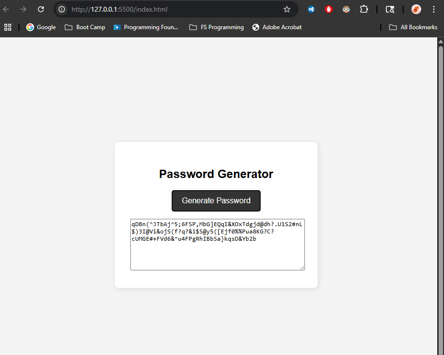

# Password Generator

## Description
This is a JavaScript-based password generator that prompts users for password criteria and returns a secure password based on their selections.

## Technologies
- HTML
- CSS
- JavaScript

## Features
- User selects length (8–128)
- Options for lowercase, uppercase, numbers, symbols
- Randomized secure output
- Responsive UI

## Link
[Live Site](https://itsyourpalsal18.github.io/03-password-generator)

## Screenshot
